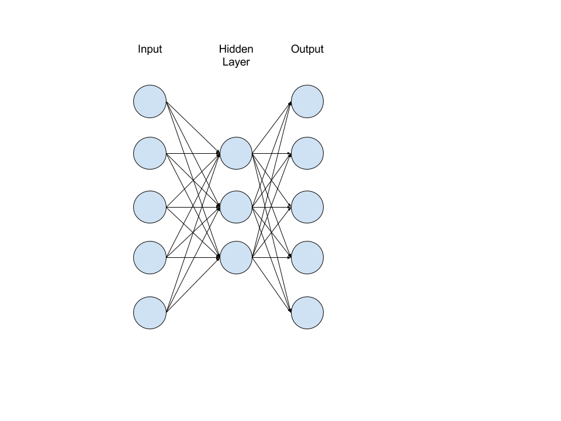
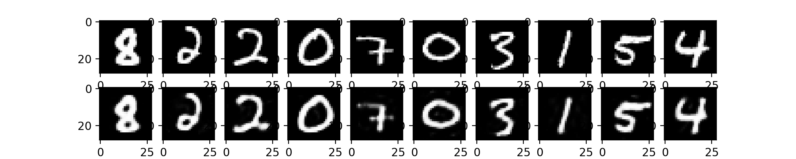
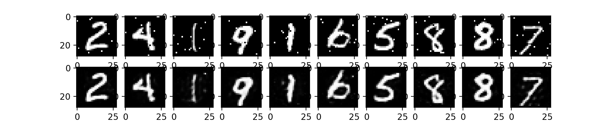

Autoencoders are unsupervised neural networks that attempt to learn the identity function, which is to say that it trains to output the input. This would be mathematically represented by $y^{(i)} = x^{(i)}$. The important factor here is what's happening in between the input and the output. Autoencoders typically reduce the dimensionality of the input within the network, then reconstructs the input to form as the output. The optimization of the loss function is then the evaluation of the output against the original input.



This can be useful in that the process of training the reconstruction of the input causes the network to learn important, latent characteristicis of the data. In this way, autoencoders perform a similar function to PCA in that it reduces the dimensions of the input to the most important subset of the input. However, unlike PCA, autoencoders can handle nonlinear data. Additionally, since the autoencoder is a network architecture, autoencoders can be stacked like any other network layer to create a deep network architecture. This dimensionality reduction or feature learning is the traditional purpose of autoencoders.

Autoencoders consist of two steps: the _encoder_ and the _decoder_. The _encoder_ is the first step wherein the dimension of the input is most often reduced. This compression is performed by hidden layers which are smaller, or have fewer neurons, than the input. The _decoder_ is the second step wherein the network attempts to expand compressed data to it's original state by connecting the often reduced dimension of the hidden layer to a layer of the same size as the input. This process practically causes the input to be approximately copied to the output having been given only a portion of the input data.

At it's most basic, the autoencoder is a neural network that squeezes the data down to latent features. For simplicity, the following is an incomplete code sample of an autoencoder:

```python
net = tflearn.input_data(shape=[None, X_train.shape[1]])

net = tflearn.fully_connected(net, 500, activation='tanh', regularizer=None, name='fc_en_1')

#hidden state
net = tflearn.fully_connected(net, 100, activation='tanh', regularizer='L1', name='fc_en_2', weight_decay=0.0001)

net = tflearn.fully_connected(net, 500, activation='tanh', regularizer=None, name='fc_de_1')
net = tflearn.fully_connected(net, X_train.shape[1], activation='linear', name='fc_de_2')

net = tflearn.regression(net, optimizer='adam', learning_rate=0.01, loss='mean_square', metric='default')

model = tflearn.DNN(net)
```

Notice this network has an input layer with 500 neurons, connected to a hidden layer with 100 neurons, connected to another hidden layer of 500 neurons. 

# Applications

As previously stated, autoencoders perform well at dimensionality reduction of nonlinear data, but are also well suited for generative applications including reconstruction of noisy or corrupted images, colorization of black and white images, as well as increasing image resolution and filling the additional pixels with enhanced detail. These same methods can be used on other types of data beyond images in order to decrease or minimize noise within the dataset.

Generative applications of autoencoders have become quite popular recently with the exploration of the theoretical connection between such architectures and latent variable models. 

## Types of Autoencoders

The above described architecture where the hidden layer has fewer neurons than the input and output layers is referred to as an __undercomplete autoencoder__. This constraint of the hidden layer results in learning the most important subset of the dimensions of the data.

One weakness of an undercomplete autoencoder is that it can fail to reveal useful information if the hidden layer is given too much leeway, thus not sufficiently compressing the data. This can be overcome using __regularized autoencoders__ which can accomodate overcomplete architectures. Regularized autoencoders use a different loss function which are capable of optimizing additional properties beyond approximating the input such as robust compensation for noise within the data, sparse representations, or reduction of the derivative of the representation.

In addition to learning feature learning and dimension reduction, autoencoders can be used in to generate content in this same fashion by applying a __denoising autoencoder__ to fill gaps in the input to perform such tasks as removing the noise from an image or, more generally, fill gaps in corupted data. 

An alternative training method known as __recirculation__ may be used with autoencoders. This training method is generally thouhgt of as more inspired by true biological processes than back-propogation and functions by comparing the network activations of the original inputs and the reconstructed inputs.

# Simple autoencoder

This is an example autoencoder network using the MNIST data set. The input is initially 784 neurons, which is stepped down to 256, 128, then up to 256 within the hidden layers before recovering it's full dimensionality of 784 for the output.

```python
from __future__ import division, print_function, absolute_import

import numpy as np
import matplotlib.pyplot as plt
import tflearn as tf

# load & prep data
import tflearn.datasets.mnist as mnist
X_train, _, X_test, _ = mnist.load_data(one_hot=True)

# build encoder
encoder = tf.input_data(shape=[None, 784])
encoder = tf.fully_connected(encoder, 256)
encoder = tf.fully_connected(encoder, 128)

# build decoder
decoder = tf.fully_connected(encoder, 256)
decoder = tf.fully_connected(decoder, 784, activation='sigmoid')

network = tf.regression(decoder, optimizer='adam', learning_rate=0.001, loss='mean_square', metric=None)

# train network
model = tf.DNN(network, tensorboard_verbose=0)
model.fit(X_train, X_train, n_epoch=20, validation_set=(X_test, X_test), run_id="auto_encoder", batch_size=256)

# recovering the session to apply to test set
encoding_model = tf.DNN(encoder, session=model.session)

# testing on new test images
X_test = tf.data_utils.shuffle(X_test)[0]

# run on test set
encode_decode = model.predict(X_test)

# show originals and reconstructions
f, a = plt.subplots(2, 10, figsize=(10, 2))
for i in range(10):
    temp = [[ii, ii, ii] for ii in list(X_test[i])]
    a[0][i].imshow(np.reshape(temp, (28, 28, 3)))
    temp = [[ii, ii, ii] for ii in list(encode_decode[i])]
    a[1][i].imshow(np.reshape(temp, (28, 28, 3)))
f.show()
plt.draw()
plt.waitforbuttonpress()
```

Notice the reconstructions are blurred and of generally lower quality than the originals, but remember that they were reduced to 16% of their original size prior to being reconstructed.  



# Denoising autoencoder

The basic example can be converted into a denoising autoencoder example simply by corrupting the input images. The autoencoder will automatically remove or diminish the noise within the images in the process of reconstruction. 

```python
from __future__ import division, print_function, absolute_import

import numpy as np
import matplotlib.pyplot as plt
import tflearn as tf


def corrupt_image(X, perc):
    X_corr = X.copy()
    num_feats = X.shape[1]

    _min = X.min()
    _max = X.max()

    for i, sample in enumerate(X):
        mask = np.random.randint(0, num_feats, perc)

        for m in mask:
            if np.random.random() < 0.5:
                X_corr[i][m] = _min
            else:
                X_corr[i][m] = _max

    return X_corr

	
# load & prep data
import tflearn.datasets.mnist as mnist
X_train, _, X_test, _ = mnist.load_data(one_hot=True)

X_train = corrupt_image(X_train, 10)
X_test = corrupt_image(X_test, 10)

# build encoder
encoder = tf.input_data(shape=[None, 784])
encoder = tf.fully_connected(encoder, 512)
encoder = tf.fully_connected(encoder, 256)

# build decoder
decoder = tf.fully_connected(encoder, 512)
decoder = tf.fully_connected(decoder, 784, activation='sigmoid')

network = tf.regression(decoder, optimizer='adam', learning_rate=0.001, loss='mean_square', metric=None)

# train network
model = tf.DNN(network, tensorboard_verbose=0)
model.fit(X_train, X_train, n_epoch=20, validation_set=(X_test, X_test), run_id="auto_encoder", batch_size=256)

# recovering the session to apply to test set
encoding_model = tf.DNN(encoder, session=model.session)

# testing on new test images
X_test = tf.data_utils.shuffle(X_test)[0]

# run on test set
encode_decode = model.predict(X_test)

# show originals and reconstructions
f, a = plt.subplots(2, 10, figsize=(10, 2))
for i in range(10):
    temp = [[ii, ii, ii] for ii in list(X_test[i])]
    a[0][i].imshow(np.reshape(temp, (28, 28, 3)))
    temp = [[ii, ii, ii] for ii in list(encode_decode[i])]
    a[1][i].imshow(np.reshape(temp, (28, 28, 3)))
f.show()
plt.draw()
plt.waitforbuttonpress()
```



While certainly not perfect, this was a very simple architecture. The noise could be further reduced and the images actually sharpened by more complicated techniques.