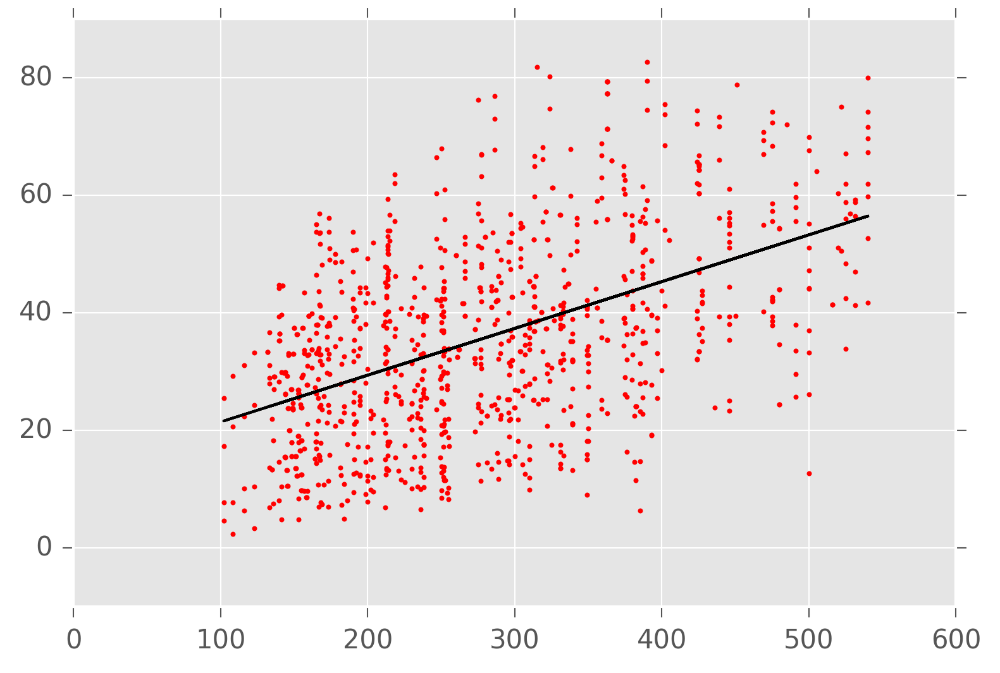
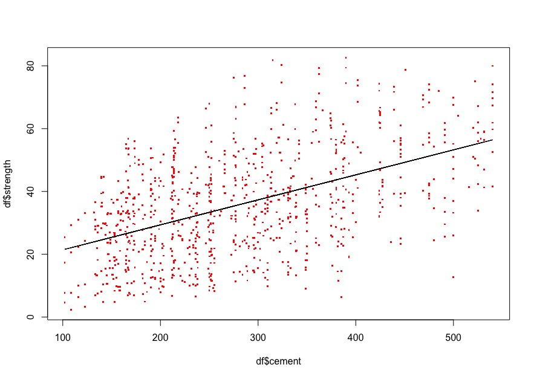

# Regression

_Regression_ algorithms predict continuous values as opposed to _classification_ algorithms which predict discrete values. Predicting weather offers an example of this. Regression would be used to predict inches of rain, classification would be used to predict whether or not it will rain. Geometrically, the difference in linear methods could be thought of in terms of optimized Euclidean distance. A well-fitted regression will minimize the average Euclidean distance between a predicted line and the observations while a similarly well-fitted classification will maximize this distance.

# Linear Regression

_Linear regression_ functions by iteratively correcting functional parameters in order to minimize the average difference between predicted values and the target values. Geometrically, it generates a predicted line and then moves it until it has minimized the average distance between the observations and the line. 

Python
```python
import matplotlib.pyplot as plt
import pandas as pd
from sklearn.linear_model import LinearRegression

# read data from csv into a new dataframe
df = pd.read_csv("concrete.csv")

# instantiate & train a linear regression model with a single feature
mdl = LinearRegression()
mdl.fit(X=df.cement.values.reshape(-1,1), y=df.strength)

# predict value using training data
y_pred = mdl.predict(df.values.cement)

# plot the data and predicted values
plt.scatter(df.cement, df.strength, color="red")
plt.plot(df.cement, y_pred, color="black", linewidth=2)
plt.show()
```



R
```r
# read data from csv into a new dataframe
df = read.csv("concrete.csv")

# instantiate & train a linear regression model with a single feature
mdl = lm(strength ~ cement, data=df)
summary(mdl)

# predict value using training data
y.pred = predict(mdl, df)

# plot the data and predicted values
plot(df$cement, df$strength, col=c("red"), pch='.', cex=3)
lines(df$cement, y.pred, col=c("black"))
```



This code sample is an example of _univariate linear regression_ which uses a single variable feature to predict the outcome. In this example case, it is using the measurement of cement to predict the strength of concrete. While certainly useful, it is somewhat limited as it does not allow for multiple influencing factors. For instance, the amount of cement alone cannot singularly predict the strength of concrete as other factors such as overall composition and age will certainly play a role. These other factors can be included quite easily in these implementations by adding them to the feature space in a method known as _multivariate linear regression_.

Python
```python
import matplotlib.pyplot as plt
import pandas as pd
from sklearn.linear_model import LinearRegression

# read data from csv into a new dataframe
df = pd.read_csv("concrete.csv")

# instantiate & train a linear regression model with all features
mdl = LinearRegression()
mdl.fit(X=df.drop('strength', axis=1), y=df.strength)

# predict value using training data
y_pred = mdl.predict(df.values.cement)
```

R
```r
# read data from csv into a new dataframe
df = read.csv("concrete.csv")

# instantiate & train a linear regression model with a all features
mdl = lm(strength ~ ., data=df)
summary(mdl)

# predict value using training data
y.pred = predict(mdl, df)
```

## Ordinary Least Squares

The most common linear regression algorithm is _Ordinary Least Squares_ (OLS) which uses the squared error, or _residual sum of squares_ (RSS) $\sum_i (y_i - f(x_i))^2$, as it's measurement of fit. An optimized OLS fit will minimize the the difference between the predicted output and the true value by iteratively adjusting the $\hat{\beta}$ coefficients.


## Feature selection

While the utility of including multiple variables cannot be argued, it can at times result in less than optimal fits. For instance, consider again the concrete strength dataset. Within this dataset, we have multiple columns all presumably contributing to some degree to the strength of the concrete. This is just a presumption, and further analysis may reveal that certain columns do not reveal significant, or any, information regarding the strength of the concrete. In these cases, including these variables can actually produce a fit that performs worse than if these columns were removed. The predictors included in a linear regression can be refined by _feature selection_, which is the process of identifying which features $x_p$ will positively contribute to the fit. It is often useful to examine the features being used for a model to verify that a better fit could not be achieved by a subset of the features. This can be done by _best subset_, _forward stepwise_ or _backward stepwise_ selection.

_Best subset_ selection is the process of trying all possible subsets of the features $x_p$. This is effective, but inefficient as it trains a model for all permutations of the feature set. _Forward stepwise_ selection starts with no features, only a constant, and then progressively adds the feature that most positively contributes to the fit. _Backward stepwise_ selection works much like forward stepwise but in reverse. It starts with all features and progressively removes the feature with the least impact on the fit. 

## Shrinkage

While feature selection can be effectively implemented to produce better fits, removing features altogether is not always an ideal solution. An alternative methodology to _feature selection_ is _shrinkage_, which performs a similar function of reducing the impact of weak or negatively contributing features with a different strategy. Where feature selection removes features, shrinkage reduces the impact of these features by minimizing the corresponding coefficient, even setting it to 0 in some cases. Shrinkage algorithms include _Lasso_ and _Ridge Regression_.

Both ridge regression and the lasso reduce the impact of features by adding a penalty term to coefficients. The ridge regression uses an $L2$ penalty ($\sum^p_1 \beta^2_j$) and the lasso uses an $L1$ penalty ($\sum^p_1 \beta_j$), both with a coefficient of $\lambda$ which is used to moderate the penalty. The $\lambda$ values are $\ge 0$ and are correlated with the degree of shrinkage that occurs; in other words, the larger the value of $\lambda$, the more the feature coefficient will be diminished. In practice, the $\lambda$ value is chosen by cross validation. $\lambda = 0$ will result in ordinary least squares for both ridge and the lasso.

```python
from sklearn.linear_model import Ridge

mdl = Ridge(alpha=0.2)
mdl.fit(X_train, y_train)

y_pred = mdl.predict(X_test)
```

```python
from sklearn.linear_model import Lasso

mdl = Lasso(alpha=0.1)
mdl.fit(X_train, y_train)

y_pred = mdl.predict(X_test)
```

## Dimensionality Reduction

A high dimensional (ie, has many features) dataset can prove problematic to fit for a variety of reasons from computational limitations to weak fits. One way to resolve these issues is feature selection, but this is not always ideal. Another way to reduce the number of features is to generate linear combinations of the original features and regress on those.


### Partial Least Squares

_Parial Least Squares_ (PLS) is another dimensionality reducing regression method that, unlike PCR, attempts to find derived features based upon their explanation of the target. PLS accomplishes this by prioritizing projected features that are most correlated with the target. As with PCR, the number of derived features $M$ should be chosen by cross-validation. This method is known to reduce bias, but can also increase variance.

```r
library(pls)

pls.mdl = plsr(y~., data=df.train, scale=TRUE, validation="CV")
summary(pls.mdl)

y.pred = predict(pls.mdl, df.test)
```