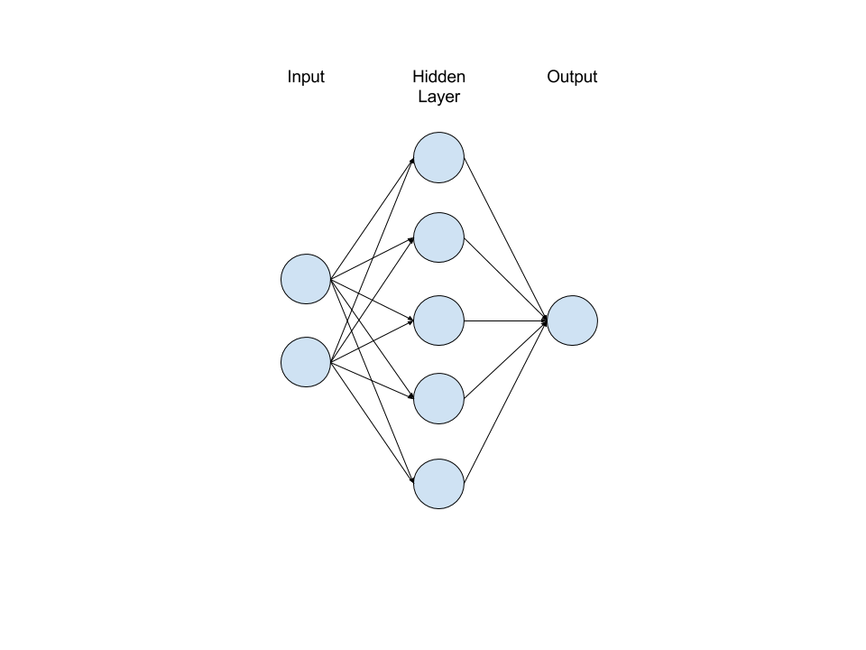
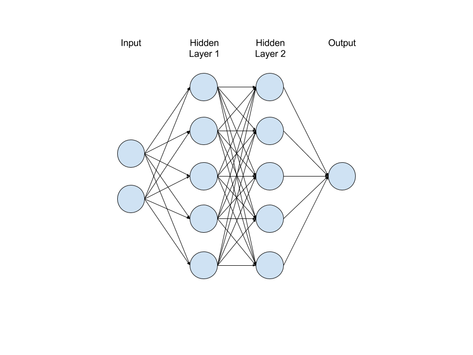
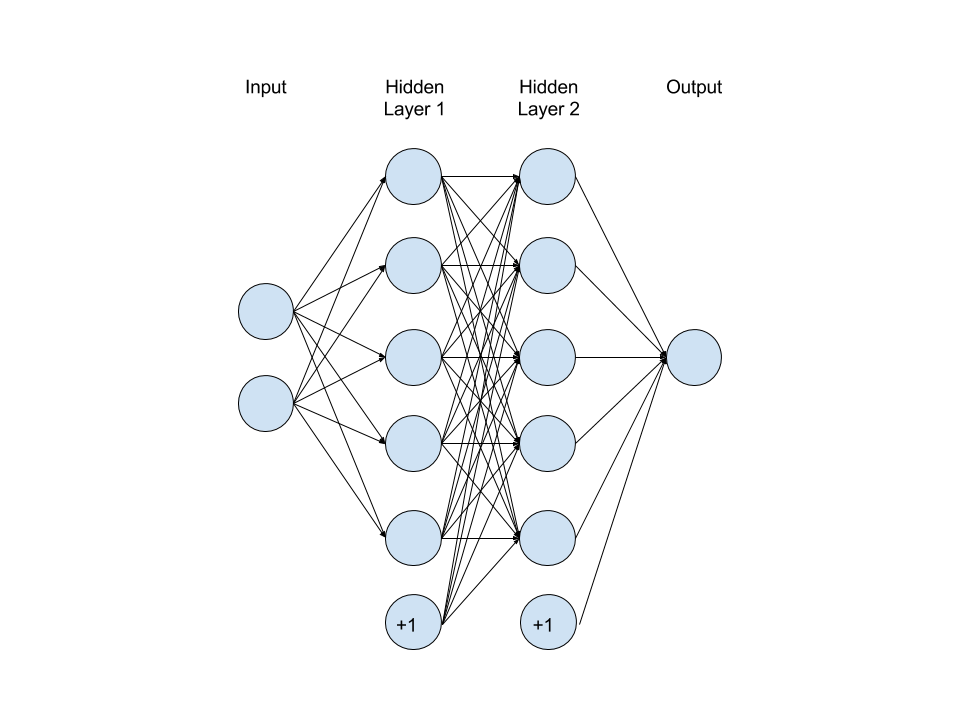

# Neural Networks

## Overview

Neural networks are groups of interconnected processing nodes which perform basic calculations which when working together create powerful estimator. These filters, called __neurons__, are arranged in one or more __hidden layers__ between the input and the output, the specifications of which is referred to as an architecture. In general, the more complicated this architecture, the more complicated the relationship the network is capable of modeling.

```python
from sklearn.neural_network import MLPClassifier

# generate some simple training data
X_train = [[0., 0.], [1., 1.]]
y_train = [0, 1]
X_test = [[0.1, 0.2]]
y_test = [0]

# define & train the network
nn = MLPClassifier(solver='lbfgs', alpha=1e-5, hidden_layer_sizes=(5,), random_state=1)
nn.fit(X_train, y_train)

nn.predict(X_test)
```

The above code defines a very simple network with 5 neurons in only one layer, set by the __hidden_layer_sizes__ parameter to __MPLClassifier()__. This simple network could be visualized as 2 nodes for the input, both of which are connected to all 5 nodes of the single hidden layer, all of which will be connected to the single output node.



Computationally, what happens here is all inputs are passed to all neurons of the hidden layer. When passed, the input values are multiplied by a coefficient unique to each path, called __weights__, which is automatically tuned during training and the product of these values is what the neuron receives. Each neuron then evaluates the value it receives by some activation function which determines it's output. This activation function could result in such simple output as 0 or 1 or a scaled function , such as a sigmoid function, which will output some value between 0 or 1. Think of this as the difference between a light switch and a light dimmer. All of this is intended to matchematically model the way our brains function by neurons firing or not firing. The neural network was historically defined with neurons which output only 0 or 1, much like our own neurons. However, as they have been used and further developed in modern machine learning applications it has become clear that they are far more effective when they permit a scale of values between 0 and 1.

### Deep Neural Networks

The preceding network is rather simple. When dealing with a more complicated relationship than our example data above, we can increase number of neurons in the hidden layer from 5 to 10, or even 100. And if this is insufficient to improve the accuracy of the model, we can add more hidden layers. For instance, let's assume that we wanted increase the number of neurons from 5 to 8 and add another hidden layer. This could be done by altering our __MLPClassifier()__ definition to the follwoing:

```python
nn = MLPClassifier(solver='lbfgs', alpha=1e-5, hidden_layer_sizes=(8,8), random_state=1)
```

And now our network looks like this:



In a single hidden layer scenario, all inputs are connected to all neurons in the hidden layer, and all of the hidden layer neurons are connected to the output. Similarly, in the case of multiple hidden layers, all neurons of each layer are connected to all neurons in the subsequent hidden layer. And just as was the case between the inputs and the first hidden layer, each connection between the first and second hidden layers will have their own unique weight which is multiplied by the output of the neurons in the first hidden layer, and the neurons in the second layer will perform their activation function upon these products before sending their output to the output neuron. Neural networks with more than one hidden layer are referred to as __deep neural networks__.

### Bias Terms

Thus far, our deep network will suffice to model some complicated relationships, but there is a fundamental flaw. If you think of the network model in terms of an equation, the only factors present are variables and coefficients. So what happens when it is given an input of 0? In this scenario, an input of 0 is guaranteed to produce an output of 0. This is desirable in certain circumstances, but certainly not all. As such, there must be some constant value, like an intercept term in a linear equation, added to the network architecture in order to guarantee a value in these situations. This intercept term is known as a __bias term__.

Bias terms are not connected to any neurons in previous layers and hold a constant value of 1. Like all other neurons in their layer, they do connect to each neuron in the subsequent layer thus providing an input effectively being the values of the weights of each connection.

Adding bias terms, our deep network can now be visualized like this:



### Architectural Design

In review, every neural network has one _input layer_, one _output layer_, and one or more _hidden layers_ between them. The _input layer_ will have a number of neurons equal to the number of features in the training data, with some adding a neuron for an input _bias term_. As for the _output layer_, if the neural network is a regressor it will have one node, and if it is a classifier it will have either a single node or one node per category.

As for the hidden layers, if the data is linearly separable then no hidden layers are necessary. Otherwise a single hidden layer is quite sufficient for the vast majority of situations. One should evaluate a variety of architectures in order to find an optimal solution.

## Deeper Explanations

### Training


### Strengths & Weaknesses

Neural networks have been proven to be a universal approximator. That is, for any given input $x$ and any given output $y$, a neural network can be trained to approximate this function. This is known as a _universality theorem_. Neural networks perform particularly well at modeling rational differences and ratios, and quite poorly with rational polynomials.

# Convolutional Neural Networks

_Convolutional Neural Networks_ are deep neural networks with hidden, convolutional layers that specifically target characteristics of the features. The way it does so is by effectively examining an observation piece by piece by way of a sliding window which only reveals small portions of the whole, then reducing the data observed to a lower dimensional representation.

As an example, a convolutional layer being used for a computer vision problem may be looking for straight lines, angles, arcs, or light or dark areas. These layers then pass their output to the next layer as an input such that, for instance, identifying a series of co-located arcs would be identified in the next layer as a circle or angles as a square. The convolutional layers may continue to build these basic characteristics into basic shapes into combinations of shapes into more complicated combinations, and these are eventually used to identify likelihood of the various classes such as a bird or a person or a car. These likelihoods are then passed to a fully connected layer which chooses the class with the highest percentage.

## References

- [An Empirical Analysis fo Feature Engineering for Predictive Modeling](https://arxiv.org/pdf/1701.07852.pdf)
- [Neural Networks and Deep Learning](http://neuralnetworksanddeeplearning.com/index.html)